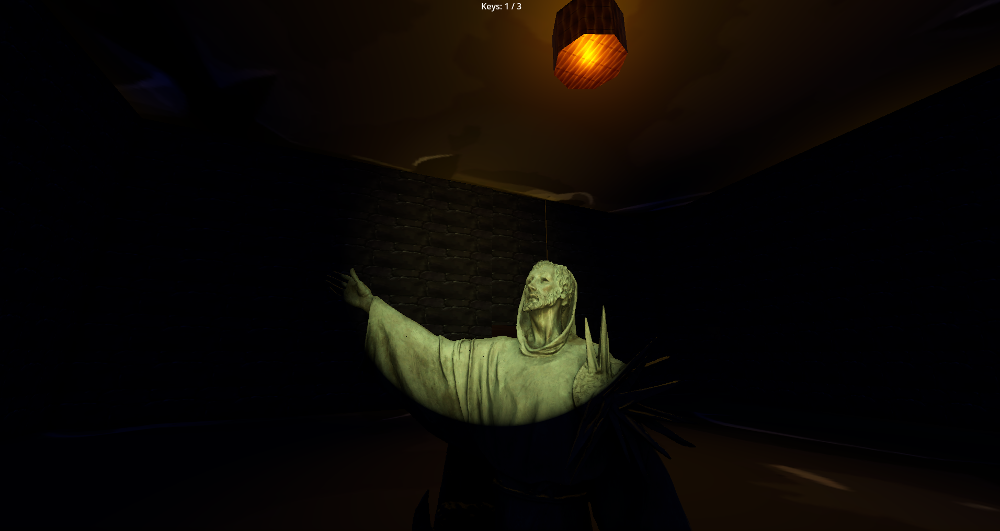
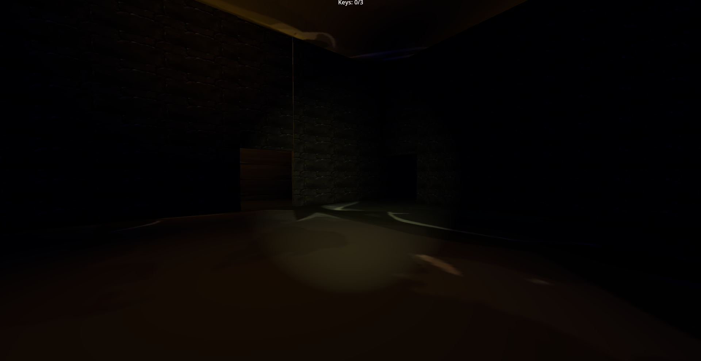
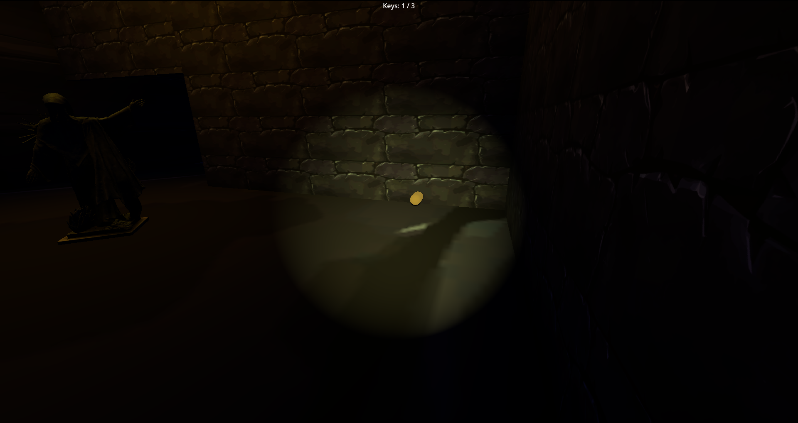
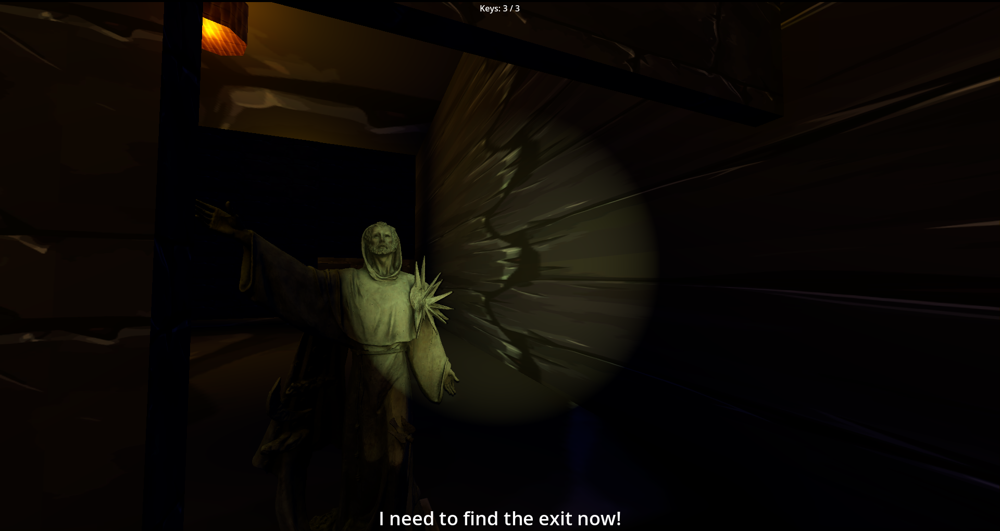

#Angel Shack (horror-escape-game)

🎯 Propuesta del juego

Angel Shack es un juego de terror en primera persona desarrollado en Godot 4, donde el jugador debe explorar un entorno oscuro, recolectar llaves y escapar mientras evita a una entidad hostil que solo se mueve cuando no es observada.

💡 Descripción

Nombre: Angel Shack

Género: Terror

Público objetivo: El juego está orientado a un público adolescente o preadolescente buscando una introducción sencilla y no muy fuerte a los juegos de horror.

Objetivo: recolectar todas las llaves y encontrar la salida sin ser atrapado

Duración por partida: Menos de 10 minutos.

🐾 Mecánica básica

El jugador aparece en un escenario laberintico donde debe de buscar llaves que aparecen aleatoriamente en el mapa mientras evita ser atrapado por la entidad, la cual solo puede moverse mienras no está siendo observada.
Una vez recolectadas todas las llaves, el jugador puede encontrar y desbloquear una puerta para escapar y vencer el juego.

🎮 Controles

W / A / S / D: Movimiento

Mouse: Cámara

E: Interactuar

ESC: Pausa

🔊 Audio

Sonidos ambientales para generar tensión.

Susurros provenientes de la entidad que aumentan en volumen cuanto más cerca está del jugador.

Sonidos de muerte.

🧩 Tecnologías utilizadas

Godot Engine 4

GDScript

🖥️ Requisitos para jugar

PC con Windows, y el ejecutable del juego disponible en releases.

Teclado y mouse

▶️ Descargar el juego

(https://github.com/RoderikLight/angel-forest/releases/tag/Windows)

🎮 Gameplay

https://drive.google.com/file/d/1egYSwDQ2agB27fYlV6ov6lYQK45XcAlP/view?usp=sharing

🧾 Créditos

Desarrollador: Rodrigo Salcedo

Año: 2025

🛠️ Licencia

Proyecto desarrollado con fines educativos y académicos.
El código puede ser revisado, modificado y reutilizado con fines de aprendizaje.